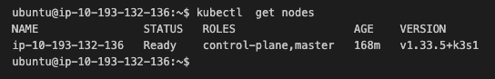
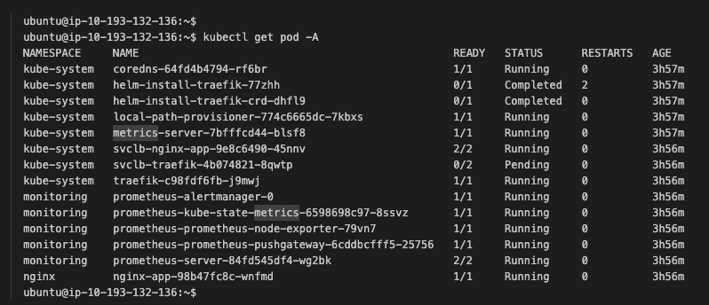
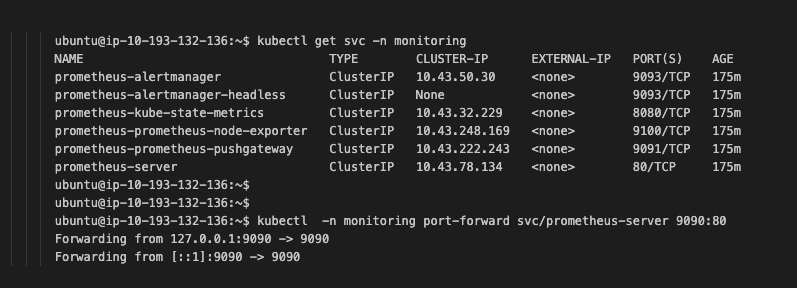
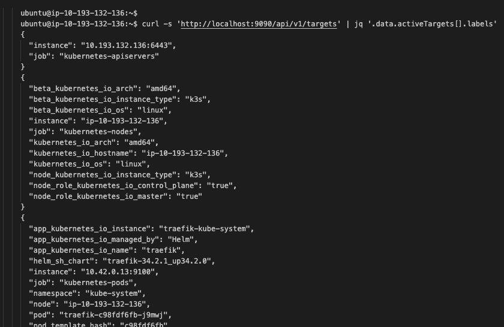
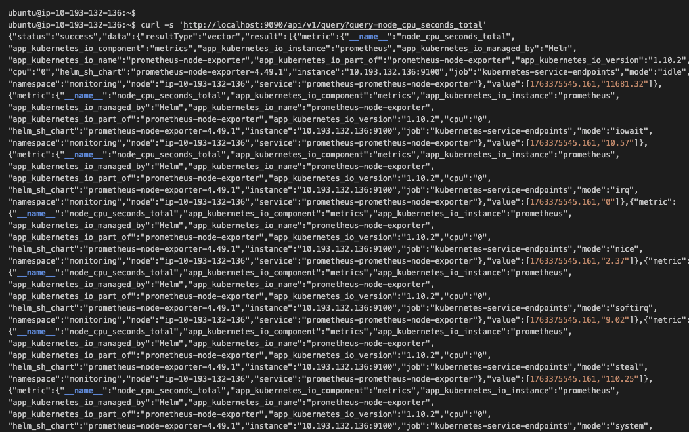

# Senior DevOps Engineer - VXG Technical Assignment

# Objective:
Provision an AWS EC2 instance, install k3s, deploy a sample application, and demonstrate basic monitoring.

# Solution

- **k3s_provision.sh**<br>
   - The script provisions a single ubuntu EC2 instance using AWS CLI commands.
   - It takes input parameters, run validations, creates AWS resources like security group, ingress rules and key pair.
   - Ingest `userdata.sh` as init-script to install k3s, helm, nginx and prometheus in EC2 instance at boot time.

- **userdata.sh**<br>
   - User-data executed on the new ubuntu EC2 instance.
   - Installs k3s, Helm on EC2 and deploys Nginx and Prometheus applications in k3s.

- The [Flow Diagram](flow_diagram.svg) demonstrates the logic followed in implementing `k3s_provision.sh` script.

- [Solution Manual](solution_manual.md) file:
    - Contains pre-requisites to execute the script
    - demonstrate the steps to execute `k3s_provision.sh` script
    - contains validations applied on input argument and aws resource in script
  
# Result:
- After successful run of `k3s_provision.sh` bash script
  - EC2 instance is created in a VPC
  - Security group, ingress rules and EC2 key-pair are created in AWS.
  - k3s is installed in EC2 instance.
  - A sample Nginx application is deployed in k3s using a Helm chart.
  - Prometheus is deployed in k3s cluster using a Helm chart
- Using `port-forwarding` and `curl` command, metics collection by Prometheus is verified (results below with commands and screenshot)

# Verifying K3s cluster and application deployment in EC2

After successful execution of `k3s_provision.sh`, I executed below steps:

**Step 1.** SSH into the EC2 instance as **ubuntu** user using the **key-pair**:
```bash
ssh -i ~/.ssh/<key-pair-name>.pem ubuntu@<ec2-instance-public-dns>
```

**Step 2.** Verify K3s cluster is installed in EC2 instance
```bash
kubectl get nodes
```


**Step 3.** Check Nginx pods are running in `nginx` namespace:
```bash
kubectl get pods -n nginx
```

**Step 4.** Check for Prometheus pods running in `monitoring` namespace:
```bash
kubectl get pods -n monitoring
```



# Verifying metrics collection by Prometheus

I performed below steps to verify metrics are collected by Prometheus 

Step 1. Show the prometheus service running in `monitoring` namespace.
  ```bash
    kubectl get svc -n monitoring
  ```
Step 2. Port-forward prometheus service
```bash
kubectl -n monitoring port-forward svc/prometheus-server 9090:80
```


Leave that running in one terminal, then in another terminal query Prometheus using `curl`.

Step 3. Verify Prometheus is scraping targets:
```bash 
curl -s 'http://localhost:9090/api/v1/targets' | jq '.data.activeTargets[].lables'
```


Step 4. Query a simple `node_cpu_seconds_total` metric to confirm Prometheus is scraping metrics:
```bash
curl -s 'http://localhost:9090/api/v1/query?query=node_cpu_seconds_total`
```


# Limitations & suggestions
- This automation creates a single-node K3s cluster on one EC2 instance (no HA). For higher availability, deploy multiple nodes or use a managed service like EKS.
- For real case scenarios, I suggest implementing infrastructure and application provisioning using Terraform, GitOps and DevOps tools to ensure scalability and maintain consistency across the infrastructure and applications.